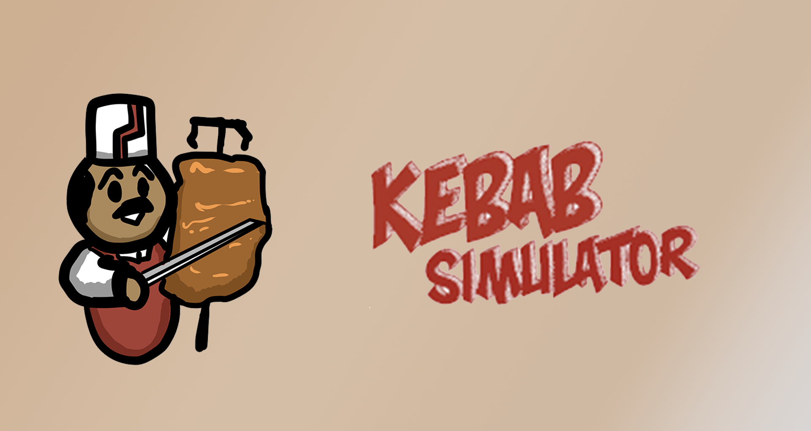

# Kebab Simulator

  

  

 

## Descripción

**Kebab Simulator** es un videojuego de gestión de un local de comida desarrollado como proyecto para la asignatura de Aplicaciones Multimedia Interactivas del Grado en Tecnologías Interactivas de la Universitat Politècnica de València (UPV). En este título, el jugador asume el rol del dueño de un restaurante de kebabs. El objetivo principal es gestionar los pedidos rápidamente, mantener la felicidad de los clientes y utilizar los beneficios obtenidos para reabastecer ingredientes o adquirir mejoras para el local, con la meta de convertirse en el mejor kebab del mundo.

 

## Características Principales

* **Ciclo de Gestión:** El jugador atiende a los clientes durante el día bajo presión de tiempo y, al finalizar la jornada, accede a una pantalla de resumen para gestionar las ganancias, reponer ingredientes en el almacén y comprar mejoras, como nuevas mesas.
* **Sistema de Reputación y Progresión:** El local cuenta con una barra de reputación (nivel) que sube al entregar pedidos precisos y rápidos, y baja si se cometen errores graves (como dar carne a un vegetariano) o si el tiempo de espera expira. Si la reputación cae a cero estando en el nivel 1, se pierde la partida.
* **Inteligencia y Estados de NPCs:** Los clientes cuentan con medidores de paciencia y estados emocionales (Feliz, Impaciente, Enfado).

 

## Stack Tecnológico

* **Motor de Videojuego:** 
* **Scripting:** 
* **Modelado 3D:** 
* **Edición de Sonido y Música:** 

 
